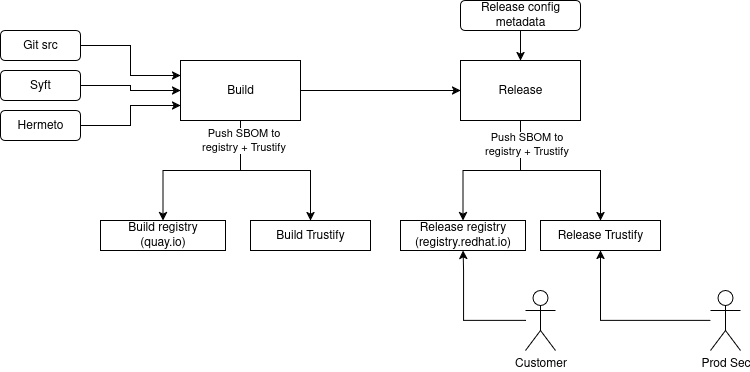

# SBOM lifecycle

The lifecycle of a Software Bill of Materials (SBOM) involves several stages.

The pipeline responsible for building and releasing software artifacts (Konflux)
is also responsible for SBOM generation and management.

The SBOM lifecycle can be divided into three main phases:

- Build phase
- Release phase
- Incident response

An overview of the SBOM lifecycle is shown below:

For each of these phases, Mobster provides specific commands to generate augment
or upload SBOMs.

  - `mobster generate` - used to generate SBOMs for different content types
  - `mobster augment` - used to augment SBOMs with additional information
  - `mobster upload` - used to release SBOMs to target locations

## Build phase
In the build phase, the pipeline produces a software artifact from the source code.
At this point Mobster generates an SBOM for given artifact based on its content
type.
At this moment Mobster supports SBOM generation for the following content types:

- [OCI image](./oci_image.md)
- [OCI index image](./oci_index_sbom.md)
- [OCI artifact](./oci_artifact.md)
- [Modelcar](./modelcar_sbom.md)

Each of these content types has its own specific command to generate SBOM and
also has its own specific structure and inputs.

Generally SBOMs are generated using following inputs based on the content type:

- Syft scan
- Hermeto SBOM
- Image pullspec
- Index manifest
- Dockerfile
- Modelcar image pullspecs

## Release phase
SBOM produced in the build phase are usually not suitable for public consumption.
In the build phase we don't know the final target of the artifact from where
a customer will pull it.

Due to this limitation, the SBOMs generated in the build phase are augmented
in the release phase. The release phase is responsible for producing a final
SBOM that is suitable for public consumption.

The general process of the release phase is as follows:

1. The SBOMs generated in the build phase are collected.
2. The SBOMs are augmented with additional information such as:
      - Image pullspec of published image
      - Repository names
3. A [product level SBOM](./product.md) is generated that contains all the SBOMs
   for the individual artifacts and product metadata such as:
      - Product name
      - Product version
      - CPE IDs

## Incident response
At the end of both the build and release phases, the SBOMs are stored in a
centralized location. The [Trustify](https://github.com/trustification/trustify)
project has been chosen as the central location for SBOM storage and management.

Since all released SBOMs are stored in a central location, they can be
used by the Product Security team to detect potential vulnerabilities
in the software components used in the released artifacts.

The Trustify project provides a way to query SBOMs and their components
to find out if a specific component is used in a released artifact. Using this
information, the Product Security team can quickly identify which artifacts
are affected by a specific vulnerability and take appropriate actions.

On top of that, SBOMs are also pushed into a container registry
to allow users to pull them directly from the registry. This allows users
to easily access SBOMs for the artifacts they are using and to verify
the components used in those artifacts.
